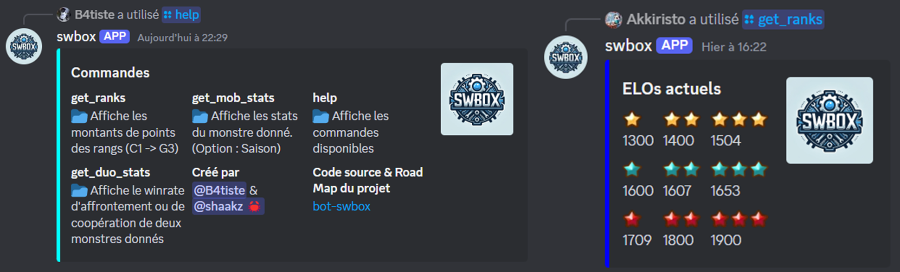
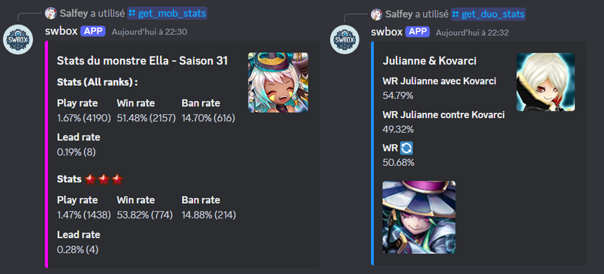

# bot-swbox

## Aperçu
`bot-swbox` est un bot Discord développé en Rust conçu pour améliorer l’expérience des utilisateurs en fournissant diverses commandes permettant d’afficher des statistiques de jeu et des données de classement. Le bot est conçu pour les joueurs de Summoners War.

Pour utiliser le bot, ajoutez-le à votre serveur Discord en contactant B4tiste sur Discord (tag : b4tiste).

## Fonctionnalités
- **Commandes interactives** : Utilisez une série de commandes slash pour accéder aux fonctionnalités du bot.
- **Informations sur les classements** : Consultez les classements et leurs détails.
- **Statistiques de jeu** : Récupérez et affichez les statistiques des monstres pour différentes saisons.
- **Statistiques de duo** : Affichez les taux de victoire communs de deux monstres joués ensemble.
- **Proposition de fonctionnalité & BUG Report** : Proposez des fonctionnalités ou signalez des bugs directement au développeur.
- **Menu d’aide** : Accédez facilement à la liste des commandes disponibles et leurs descriptions.

---

## Roadmap des fonctionnalités

### ToDo :

- [ ] Ajouter le collage d'image pour la commande `get_duo_stats`
- [ ] Passer sur la BDD de GodsArmy pour le /track des pseudos
- [ ] Passer le bot en anglais

### Terminé :

- [x] Ajouter la commande /help
- [x] Check si il y a un 2A dans la liste des monstres recherchés, si oui, le bot doit le choisir en priorité
- [x] Ajouter le choix de choisir le numéro de saison pour les stats de monstre
- [x] Ajouter une commande pour afficher les taux de victoire communs de deux monstres joués ensemble. Affiche aussi le taux de victoire de l'un contre l'autre.
- [x] Ajouter une commande de proposition de fonctionnalité
- [x] Refaire les commandes de suivi de compte pour afficher tous les pseudos liés à un compte

---

## Guide utilisateur

### `/help`
**Description** : Affiche les commandes disponibles et leurs descriptions.

**Utilisation** :
- Tapez `/help` dans le chat Discord pour afficher la liste de toutes les commandes supportées.

**Résultat** :
- Un message intégré (embed) bien formaté avec :
  - Une liste des commandes avec leurs descriptions.
  - Les détails des créateurs.
  - Un lien vers le code source et la roadmap du projet.

---

### `/get_ranks`
**Description** : Affiche les informations détaillées des classements actuels de RTA.

**Utilisation** :
- `/get_ranks`

**Résultat** :
- Présente les données des classements dans un format facile à lire.

---

### `/get_mob_stats`
**Description** : Récupère les statistiques des monstres, avec une option pour spécifier la saison.

**Utilisation** :
- `/get_mob_stats` => Ouverture d'un formulaire pour saisir le nom du monstre et la saison (optionnel).

**Fonctionnalités** :
- Priorise automatiquement les monstres 2A dans les recherches lorsque cela est applicable.
- Permet de récupérer des données spécifiques à une saison.

---

### `/get_duo_stats`
**Description** : Affiche le winrate d'affrontement ou de coopération de deux monstres donnés.

**Utilisation** :
- `/get_duo_stats` => Ouverture d'un formulaire pour saisir les noms des deux monstres.

**Fonctionnalités** :
- Priorise automatiquement les monstres 2A dans les recherches lorsque cela est applicable.

---

### `/track_player_names`
**Description** : Affiche les différents noms d'utilisateurs que ce joueur a pu avoir. Recherche possible avec l'ID ou le pseudo d'un compte (Données : SWARENA)

**Utilisation** :
- `/track_player_names` => Ouverture d'un formulaire pour saisir le nom ou l'ID du joueur.

---

### `/send_suggestion`
**Description** : Permet d'envoyer une suggestion de fonctionnalité ou de déclarer un BUG

**Utilisation** :
- `/send_suggestion` => Ouverture d'un formulaire pour saisir une suggestion.

**Fonctionnalités** :
- L'utilisateur peut fournir une image pour illustrer sa suggestion.

---

## Contributions
Ce projet est maintenu et développé par :
- [B4tiste](https://github.com/B4tiste)
- [shvvkz](https://github.com/shvvkz)

Les données proviennent de :
- [SWARENA](https://swarena.gg/) développé par [Relisora](https://github.com/relisora)
- [SWARFARM](https://swarfarm.com/)
- [SWRT](https://m.swranking.com/)

Si vous souhaitez contribuer à ce projet, veuillez contacter B4tiste sur Discord (tag : b4tiste)

---

## Images du bot

