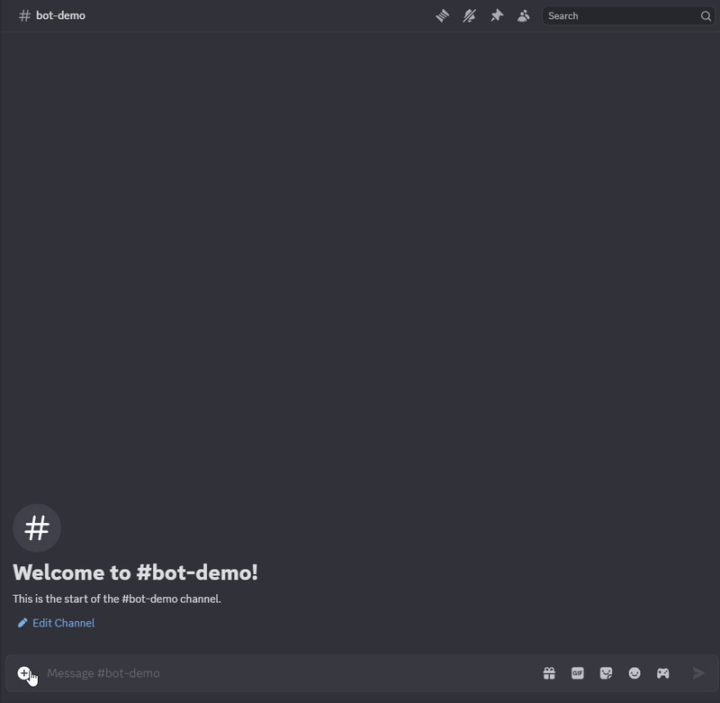

# bot-swbox

Discord bot for Summoners War, written in Rust with poise/serenity.

## Quick Links

- Website: [BOT Website](https://bot-swbox.netlify.app/)
- Demo video: [Youtube Guide](https://www.youtube.com/watch?v=U6CxFH6WFKU)
- Support/community: https://discord.gg/AfANrTVaDJ

## What This Bot Does

SWbox focuses on RTA and account analysis workflows:

- Fetch live RTA rank thresholds and optional prediction cutoffs.
- Show player stats (including LD/top monsters and replay snapshots).
- Provide monster stats with matchup/team insights by rank bracket.
- Browse interactive leaderboard pages and open player details directly.
- Analyze exported game JSON files (runes score, account summaries, core trios).
- Offer helper utilities such as player-name history, support links, and services.

## Current Slash Commands

These are the commands currently registered by the bot:

- `/help`
- `/get_ranks`
- `/get_mob_stats`
- `/send_suggestion`
- `/track_player_names`
- `/upload_json`
- `/get_player_stats`
- `/get_rta_leaderboard`
- `/get_rta_core`
- `/get_replays`
- `/get_meta`
- `/best_pve_teams`
- `/support`
- `/services`
- `/how_to_build`
- `/register`
- `/unregister`
- `/mystats`

## Command Details

### `/get_ranks`

Shows current SWRT rank thresholds (P2 to G3), with prediction values when available.

### `/get_rta_leaderboard [page]`

Shows a paginated leaderboard (10 players per page), with buttons and a select menu to open selected player stats.

### `/get_player_stats <player_name>`

Shows detailed player info, LD monsters, top monsters, worst opponent monsters, and replay image.

Supports:
- Regular name search
- Alias lookup
- Discord mention lookup if the user is linked via `/register`

### `/mystats`

Shows stats for your linked account (requires prior `/register`).

### `/register <account_name>`

Links your Discord user to an SWRT player ID using a search + selection flow.

### `/unregister`

Removes your linked account from the database.

### `/get_mob_stats <monster_name>`

Shows monster performance data and matchup insights. Includes interactive rank-bracket buttons.

### `/get_replays <monster1> [monster2] [monster3] [monster4] [monster5]`

Finds recent replays containing selected monsters and renders a replay image grid.

### `/get_meta`

Displays current tierlist-style meta for selectable rank brackets.

### `/how_to_build <monster_name>`

Shows runes/artifact trends from Lucksack, with rank filters (G3, G1-G3, P2-P3, P1).

### `/best_pve_teams <dungeon>`

Returns best-performing PvE teams for selected content (Giants, Dragons, Necro, etc.).

### `/upload_json <file> [mode]`

Uploads Summoners War JSON and generates account/rune score summary.

Supported modes:
- `Classic`
- `NoSpeedDetail`
- `Anonymized`
- `NoSpeedDetailAndAnonymized`

### `/get_rta_core <file> <rank> [monster] <mode>`

Computes top trios from your box and current meta data.

Supported rank values:
- `C1`, `C2`, `C3`, `P1`, `P2`, `P3`, `G1`, `G2`, `G3`

Supported mode values:
- `MetaSlayer`
- `FunAndCasual`

### `/track_player_names <mode>`

Retrieves known past usernames (SWArena-based), with search mode:
- `Name`
- `Id`

### `/send_suggestion`

Opens a modal to send suggestions or bug reports (with optional image URL).

### `/support`

Displays support and donation information.

### `/services`

Displays partner/service information.

## Data Sources

The bot currently pulls data from multiple sources depending on command:

- SWRT: https://m.swranking.com/
- SWArena: https://swarena.gg/
- Lucksack: https://lucksack.gg/
- SWCalc (PvE teams): https://swcalc.cz/
- Coupons feed: https://sw-coupons.netlify.app/

## Tech Stack

- Rust (edition 2021)
- poise + serenity (Discord interactions)
- tokio (async runtime)
- reqwest + serde/serde_json (API requests and parsing)
- mongodb (logs, account links, JSON score history, coupons)
- image/imageproc/ab_glyph (replay image rendering)
- moka (caching)

## Contributing

Maintainers:

- B4tiste: https://github.com/B4tiste
- shvvkz: https://github.com/shvvkz

If you want to contribute, open an issue or contact the maintainers on Discord.

## Demo Assets

### `/get_player_stats`

### `/get_mob_stats`

aze