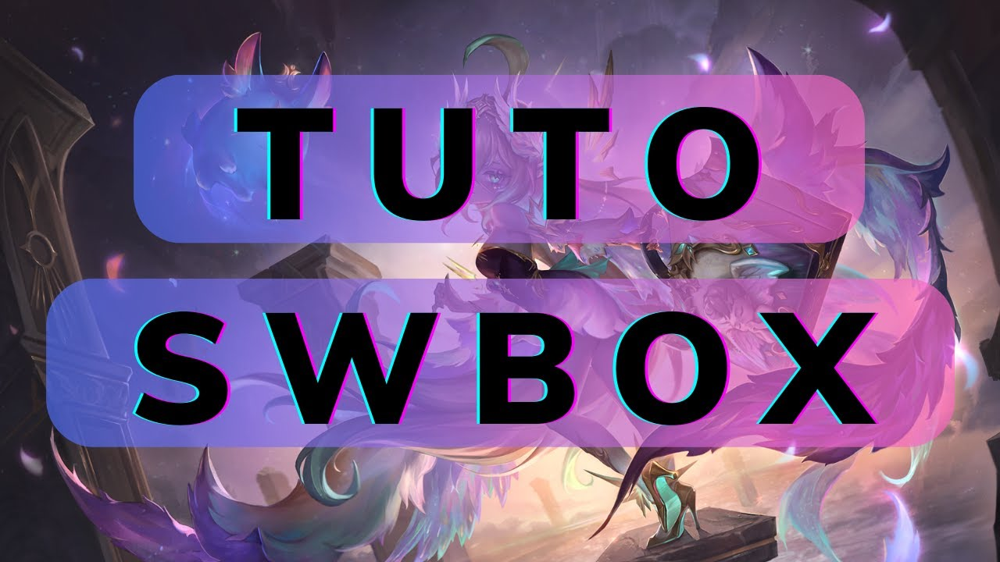

# bot-swbox

## Overview

`bot-swbox` is a Discord bot developed in Rust designed to enhance user experience by providing various commands to display game statistics and ranking data. The bot is designed for Summoners War players.

To use the bot, add it to your Discord server by contacting B4tiste on Discord (tag: b4tiste).

## Installation Guide (French)

Click on the image to go to the French Youtube Video Guide :

## Features

-   **Interactive Commands**: Use a series of slash commands to access the bot's features.
-   **Ranking Information**: View rankings and their details.
-   **Player Statistics**: Retrieve and display detailed information about a player's account, including their rank, win rate, LD5 and most played monsters.
-   **Mob Statistics**: Retrieve and display monster statistics for different seasons.
-   **RTA Core Trios**: Shows 15 trios to play in RTA for a given account and selected rank.
-   **Duo Statistics**: Display common win rates of two monsters played together.
-   **JSON File analysis** : Gives a small breakdown of your account
-   **Feature Suggestion & BUG Report**: Suggest features or report bugs directly to the developer.
-   **Help Menu**: Easily access the list of available commands and their descriptions.

---

## Feature Roadmap

### ToDo:

-   [ ] Create a commande `/get_replays <Monster1> <Monster2> ...` that gives the replays of the last 10 replays containing the monsters in the list.
-   [ ] Find something that Unaxe can do so that he stops ouin-oui'ing.

### Completed:

-   [x] Create the command that gives trio cores for a given JSON.
-   [x] Switch to SWRT for data.
-   [x] Add replay on player stats.
-   [x] Separate RTA & Siege JSON analysis using different coeffs.
-   [x] Add the /upload_json command to get an analysis of the JSON file.
-   [x] Translate the bot to English.
-   [x] Add the /help command.
-   [x] Check if there is a 2A in the list of searched monsters, if so, the bot should prioritize it.
-   [x] Add the option to choose the season number for monster stats.
-   [x] Add a command to display the common win rates of two monsters played together. Also displays the win rate of one against the other.
-   [x] Add a feature suggestion command.
-   [x] Redo the account tracking commands to display all usernames linked to an account.
-   [x] Add image embedding for the `get_duo_stats` command.

---

## User Guide

### `/help`

**Description**: Displays the available commands and their descriptions.

**Usage**:

-   Type `/help` in the Discord chat to display the list of all supported commands.

**Result**:

-   A well-formatted embedded message with:
    -   A list of commands with their descriptions.
    -   Creator details.
    -   A link to the source code and project roadmap.

---

### `/get_ranks`

**Description**: Displays detailed information about the current RTA rankings.

**Usage**:

-   `/get_ranks`

**Result**:

-   Presents ranking data in an easy-to-read format.

---

### `/get_rta_leaderboard`

**Description**: Displays an interactive RTA leaderboard with pagination and player stat selection.

**Usage**:

-   `/get_rta_leaderboard` — Displays the first page of the leaderboard.
-   `/get_rta_leaderboard page:<number>` — Displays the specified leaderboard page directly.

**Features**:

-   📊 **Paginated leaderboard** showing player name, country, and ELO.
-   ⬅️➡️ **Navigation buttons** to browse leaderboard pages.
-   🔍 **Select menu below the leaderboard**: pick a player from the current page to view their RTA stats instantly.
-   📈 When a player is selected, their RTA performance (rank, ELO, winrate, LD monsters, top units) is shown right away.
-   ✅ No need to retype `/get_player_stats`, it’s handled automatically.

---

### `/get_player_stats`

**Description**: Displays detailed information about a player's account.

**Usage**:

-  `/get_player_stats` + `USERNAME`

**Features**:
-   Displays the player's rank, win rate, and other relevant statistics.
-   Displays the player's LD5 and Most Played Monsters with their win rates.
-   Displays the last six replays of the player

---

### `/get_mob_stats`

**Description**: Retrieves monster statistics. It also displays some great combo and counter to that monster.

**Usage**:

-   `/get_mob_stats` + The name of the monster you want to search for with an autocomplete feature.

**Features**:

-   Allows you to choose the rank you want to see the stats for.

---

### `/get_duo_stats`

**Description**: Displays the win rate of two given monsters either in confrontation or cooperation.

**Usage**:

-   `/get_duo_stats` => Opens a form to enter the names of the two monsters.

**Features**:

-   Automatically prioritizes 2A monsters in searches when applicable.

---

### `/track_player_names`

**Description**: Displays the different usernames that this player may have had. Searchable by ID or account username (The player must exist on SWARENA).

**Usage**:

-   `/track_player_names` => Opens a form to enter the player's name or ID.

---

### `/send_suggestion`

**Description**: Allows sending a feature suggestion or reporting a BUG.

**Usage**:

-   `/send_suggestion` => Opens a form to enter a suggestion.

**Features**:

-   The user can provide an image to illustrate their suggestion.

---

### `/upload_json`

**Description**:
Uploads a JSON file to analyze account data and display an account score along with detailed information about rune set efficiency percentages and rune speeds. This command is particularly useful for Summoners War players looking to quickly assess their account's performance metrics. The Scores will be saved in a Database to be able to compare them over time.

**Usage**:

-   Type `/upload_json` in your Discord server.
-   Attach a JSON file (with a `.json` extension) containing the account data.

---

### `/get_rta_core`

**Description**

Analyzes an RTA/Siege export JSON file and suggests 15 “core” trios to play for the chosen rank. The list is based on the following criteria:
- Trio **win rate**
- Total trio **pick count**
- **Penalty** for late-picks (to downrank lately-picked monsters)
- **Bonus** if Light/Dark monsters are included

**Usage**

- Type `/get_rta_core` in your Discord server.
- Attach a JSON file (with a `.json` extension) containing the account data.
- Select the rank you want to analyze.

**Result**

Sends a Discord message listing up to 15 trios (as emojis), each showing:
- **Win Rate** (in %)
- **Total Picks** count

## Contributions

This project is maintained and developed by:

-   [B4tiste](https://github.com/B4tiste)
-   [shvvkz](https://github.com/shvvkz)

Data is sourced from:

-   [SWARENA](https://swarena.gg/) developed by [Relisora](https://github.com/relisora)
-   [SWARFARM](https://swarfarm.com/)
-   [SWRT](https://m.swranking.com/)

If you wish to contribute to this project, please contact B4tiste on Discord (tag: b4tiste).

---

## Demo

### 1. **/get_player_stats**

### 2. **/get_mob_stats**

